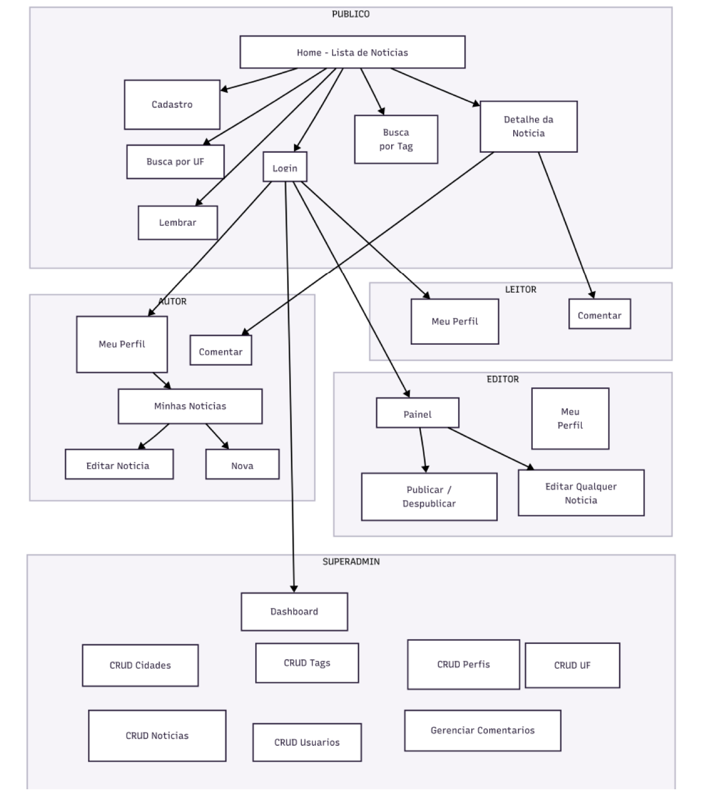

# programacao-app-1s-2026

Desenvolvimento em React Native para a disciplina de Programação de App do curso de Engenharia de Software/UCB

# Branches

Este projeto está dividido em 3 branches de acordo com a disciplina

- `main`: Instruções das Branches
- `Projeto_Final`: arquivos do projeto final (RN/Expo)
- `E03_Telas`: arquivos da **entrega 03/2.1**, de acordo com a imagem 1.
- `E03_CRUD-ORM`: arquivos da _aplicação CLI_ abordada na **entrega 03/2.2**.
- `E04_RN-CRUD-ORM`: arquivos da **entrega 04/2.1**.

Imagem 1:

